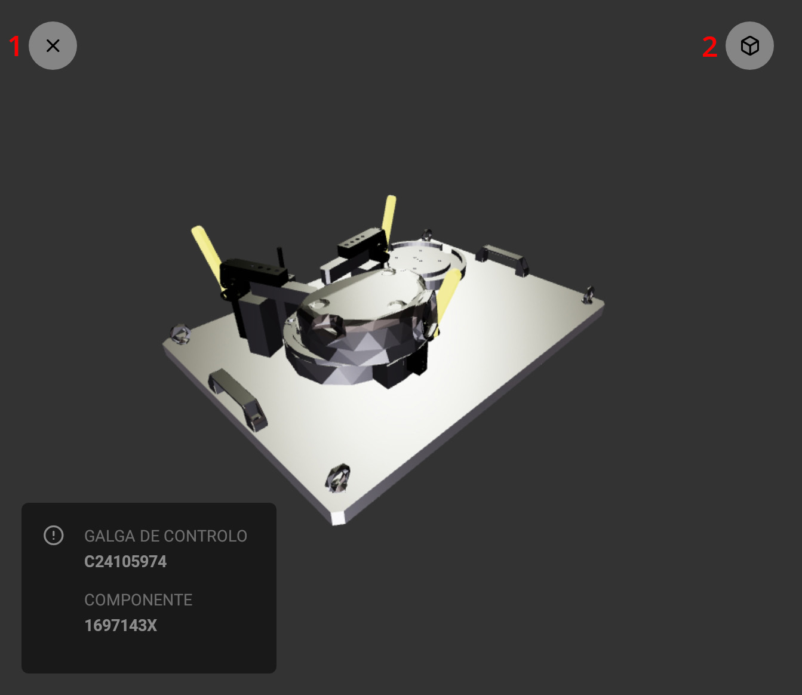

# Guia de Utilização - Digital Manual (Mobile)

[Download PDF](https://github.com/giu7d/ar-manual-mobile/blob/dev/docs/pt/user-guide.pdf)

## Índice

1. [Login](##login)
1. [Galgas de Controlo](##galgas-de-controlo)
1. [Realizar Análise](##realizar-análise)

## Login

A tela de login é composta por um formulário com os campos email e senha. Ambos os campos são obrigatórios. Para iniciar o uso da aplicação **insira a seu email e senha**, posteriormente **selecione o botão "ENTER"**.

**Em caso de erro no login**, a seguinte tela de error será exibida. A tela de error contem informações sobre o erro ocorrido e também um botão que permite ao usuário retornar a tela anterior e tentar realizar o login novamente.

Se o login ocorreu corretamente, a tela de listagem de galgas de controlo estará disponível.

**Importante:** Após realizar o login, os dados de autenticação do usuário ficam salvos no dispositivo. Caso deseje sair da conta é necessário utilizar a opção de "log out".

## Galgas de Controlo

A tela de galgas de controlo apresenta as seguintes funcionalidades:

1. Listar manuais disponiveis
1. Iniciar Teste
1. Visualizar QR Code
1. Realizar Log out

## Realizar Análise

A tela de análise apresenta as seguintes partes:

1. [Canvas de visualização](###canvas-de-visualização)
1. [Informações da análise](###informações-da-análise)
1. [Instruções](###instruções)

### Canvas de visualização

A canvas de visualização é utilizada para **visualizar a operação relacionada a instrução selecionada**, esta tela apresenta as seguintes funcionalidades:

#### 1. Desistir da análise

Ao selecionar está opção um alerta será exibido e caso confirme, **a analise será descartada**. O usuário será retornado a tela de listagem das galgas de controlo.

#### 2. Alterar modo de visualização (Imagem ou 3D)

Ao selecionar está opção o modo de visualização da canvas é alterado.

O **modo de imagem** é estático, exibe imagens extraídas do manual do componente e não oferece opções de interação.

O **modo de 3D** exibe animações da operação que será realizada, permite o uso de zoom _(gesto de pinça com dois dedos)_ e movimento da camera _(deslizar o dedo sobre a tela)_.

### Informações da Análise

Está seção apresenta informações sobre o modelo do componente e da galga de controlo que está sendo utilizada na análise.

### Instruções

O componente de instruções é composta pelo **progresso da análise (1)**, **card de instrução (2)** e botão "FINALIZAR".

#### Progresso da análise

O progresso da análise é atualizado conforme as instruções são realizadas.

#### Instrução

As instruções podem ser:

1. Selecionadas
1. Aprovadas
1. Reprovadas

Ao selecionar uma instrução as opções de aprovar e reprovar serão exibidas.

Ao **aprovar uma instrução**, o usuário será encaminhado para a próxima instrução automaticamente.

Ao **reprovar uma instrução**, o usuário será levado a uma tela especifica para reportar a falha. Nessa tela, o usuário deverá:

1. Selecionar a falha encontrada (obrigatório)
1. Adicionar informação adicional, utilizando o campo de descrição (opcional)
1. Registrar uma foto da falha, acionará a camera do dispositivo (obrigatório)
1. Selecionar o botão "reportar falha" para finalizar.

**Após todas as instruções terem sido realizadas** e o progresso da análise ter sido concluído **é necessário selecionar o botão "FINALIZAR" para reportar a análise**.

Finalmente, a análise será registrada e o usuário será redirecionado a tela de listagem das galgas.
