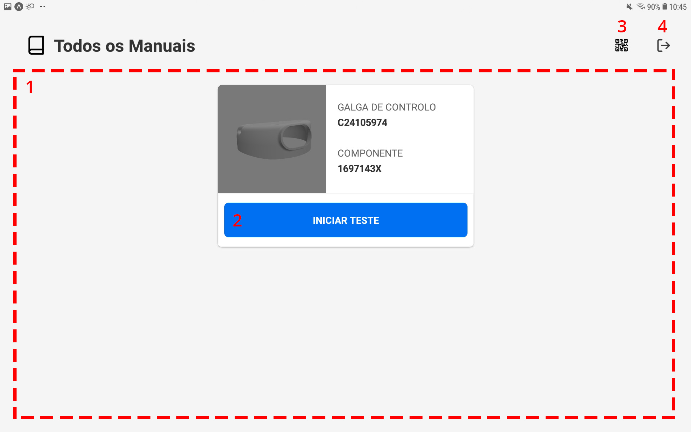
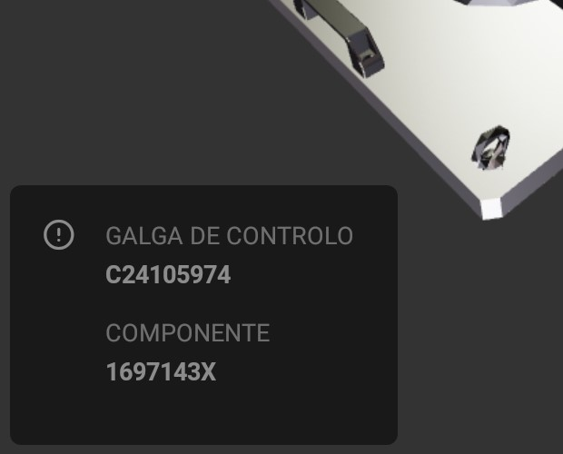
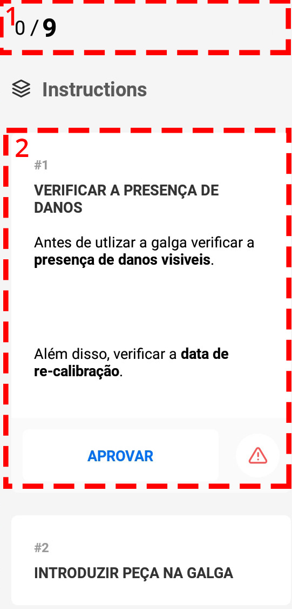
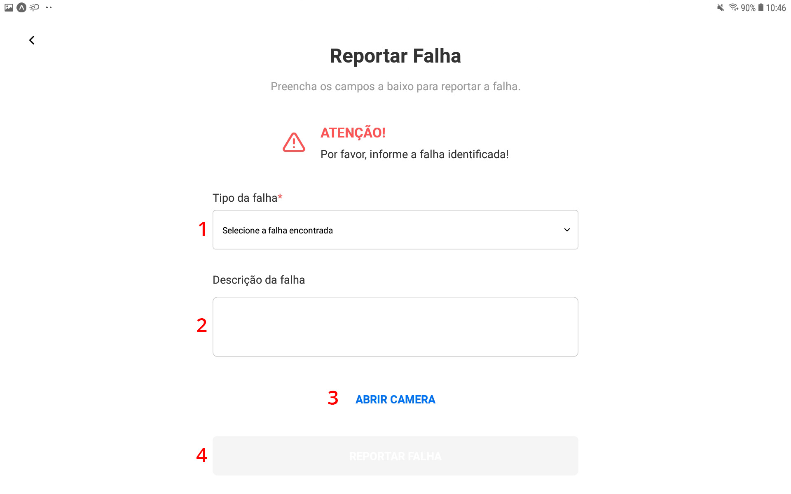

# User Guide - Digital Manual (Mobile)

## Índice

1. [Login](##login)
1. [Galgas de Controlo](##galgas-de-controlo)
1. [Realizar Análise](##realizar-análise)

## Login

A tela de login é composta por um formulário com dois campos, email e senha. Ambos os campos são obrigatórios. Para iniciar o uso da aplicação primeiro insira a suas informações de login e selecione o botão "enter".

Em caso de erro no login, a seguinte tela será exibida. A tela de error contem informações sobre o erro ocorrido e também um botão que permite ao usuário retornar a tela anterior e tentar realizar a operação novamente.

Se tudo ocorreu corretamente, a tela de listagem de galgas de controlo estará disponível.

**Importante:** Após realizar o login, os dados de login do usuário ficam salvos. Caso deseje sair da conta é necessário utilizar o recurso de "log out" antes de iniciar qualquer outra operação.

## Galgas de Controlo

A tela de galgas de controlo apresenta as seguintes funcionalidades:

1. Listar Galgas de Controlo
1. Iniciar Teste
1. Visualizar QR Code
1. Realizar Log out

## Realizar Análise

A tela de análise apresenta as seguintes partes:

1. Canvas de visualização
1. Informações da galga de controlo
1. Instruções

### Canvas de visualização

A canvas de visualização é utilizada para visualizar a operação relacionada a instrução selecionada, apresenta as seguintes funcionalidades:

#### 1. Desistir da análise

Ao selecionar está opção um alerta será exibido, caso confirme, a analise será descartada.

#### 2. Alterar modo de visualização (Imagem ou 3D)

Ao selecionar está opção o modo de visualização é alterado.
O modo de imagem é estático e não oferece opções de interação.
O modo de 3D permite o uso de zoom (gesto de pinça com dois dedos) e movimento da camera (deslizar o dedo sobre a tela).

### Informações da galga de controlo

Está seção apresenta informações dop modelo do componente e da galga de controlo que está sendo utilizada na análise.

### Instruções

O componente de instruções é composta pelo progresso da análise (1), instrução (2) e botão para finalizar (3).

#### Progresso da análise

O progresso da análise é atualizado conforme as instruções são realizadas.

#### Instrução

As instruções podem ser selecionadas, aprovadas ou reprovadas.

Ao selecionar uma instrução as opções de aprovar e reprovar serão exibidas.

Ao selecionar a opção de **aprovar uma instrução**, o usuário será encaminhado para a próxima instrução será selecionada.

Ao **reprovar uma instrução**, o usuário será levado a uma tela especifica para reportar a falha. Nessa tela, o usuário devera selecionar a falha encontrada (1) e registrar uma foto da falha (2). Caso deseje adicionar mais alguma informação é possível utilizar o campo de descrição (3) para informações adicionais. Após as informações adicionadas basta selecionar "reportar falha".

Após todas as instruções terem sido realizadas e o progresso da análise ter sido concluído é necessário selecionar o botão "finalizar" para reportar a análise.

Após essa operação o usuário será levado a tela de listagem das galgas.
